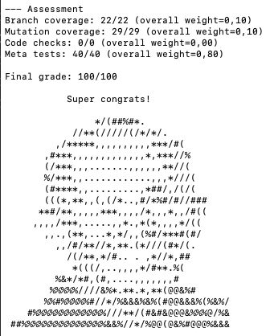

# Andy

Andy (*) is a tool developed for CSE1110, the TU Delft's course on software testing and quality. 
Given some method or class to test and the student's test suite, Andy runs a set of checks and metrics,
and provides the student with feedback.

More specifically, Andy provides:

* Test coverage: Line, instruction, and branch coverage (via JaCoCo)
* Mutation coverage: How many mutants the test suite kills (via Pitest)
* Code checks: Static code checks, written by the teacher, to detect specific 
characteristics of the students' tests.
* Meta tests: A set of manually written mutants that should be killed by the students' tests.

The screenshot below shows the bottom part of the assessment, containing the final grade.

## Configuration

Teachers can configure how the student's test should be assessed. To that aim, the teacher 
writes a `RunConfiguration` class. See the many examples in our [test folder](https://github.com/cse1110/andy/tree/main/src/test/resources/grader/fixtures/Config).
The teacher can configure:

* The weights of the different assessments
* Which code checks to run
* Which meta tests to run

### Code checks

The tool contains different checks for JUnit, Mockito, and JQWik tests:

- Test methods:
    - `NumberOfTests`: checks whether the test suite has a minimum number of tests.
    - `TestMethodsHaveAssertions`: checks whether all test methods have assertions.
    - `LoopInTestMethods`: checks whether there is a loop in a test method.
    - `UseOfStringLiterals`: checks whether there is a string literal in a test method.
    - `MethodCalledInTestMethod`: checks whether a method was invoked in a test method.

- Mockito:
    - `MockClass`: Checks whether a class was mocked in the test suite.
    - `MockitoSpy`: Checks whether spies are used.
    - `MockitoVerify`: Checks whether a specific verify has happened.
    - `MockitoWhen`: Checks whether a specific when() has happened.

- JQWik:
    - `JQWikProperty`: checks whether the test suite has a minimum number of properties.
    - `JQWikProvide`: checks whether the test suite has a minimum number of provide.
    - `JQWikCombinator`: checks whether a Combinator was used.
    - `JQWikArbitrary`: checks whether a specific Arbitrary<X> is provided by any method in the test suite.
    - `JQWikArbitraries`: checks whether a Arbitraries.x() is used in the test suite.
    - `JQWikProvideAnnotations`: checks whether tests use Provide annotations, e.g., @ForAll, @Positive.

Each of these checks receive different parameters. Check their specific Javadoc for more details.

### Meta Tests

Meta tests are basically mutants of the code under test. Teachers write those to ensure that the
student's test suite contains the test cases they expect. If the test suite fails with the mutated
version of the code, this means the student wrote a test for that case. 

The API is very simple and basically enables teachers to replace parts of the code under test, by
[replacing strings](https://github.com/cse1110/andy/blob/main/src/main/java/nl/tudelft/cse1110/andy/config/MetaTest.java#L27),
[replace lines](https://github.com/cse1110/andy/blob/main/src/main/java/nl/tudelft/cse1110/andy/config/MetaTest.java#L36), or
[inserting new code at specific places](https://github.com/cse1110/andy/blob/main/src/main/java/nl/tudelft/cse1110/andy/config/MetaTest.java#L45).

### Modes

Andy can be configured in three different modes:

* **PRACTICE:** Made for formative assessment and practice. Students can see the assessment with or without hints. When running without hints, 
the tool shows the grade that their solution achieves, but does not say which checks it fails. When run with full hints, the tool shows exactly which
checks are failing.

* **EXAM:** Made for summative assessment. In exam mode, students can only see the results of code coverage
and mutation coverage (what they would see as developers). 

* **GRADING:** Made for teachers to run after the exam is done. It runs the full assessment, produce final grades, and 
provides the full description of how the grade was calculated.

## Running

Andy is a simple Java application. All it needs is:

* A directory containing three files: the code to be tested (usually in a `Library.java` file),the student's solution (in a `Solution.java`) and a configuration (`Configuration.java`)
* An empty directory where the output will be produced. You may expect JaCoCo and Pitest reports to also be stored in these folders.

For TU Delft students, Andy can be used directly in WebLab, our cloud IDE.

_We are working on a command-line tool that will make Andy easier to be executed_.

## Team

Andy was envisioned by Maurício Aniche and Frank Mulder.

Summer 2021 team: Nadine Kuo, Jan Warchocki, Florena Buse, Teodor Oprescu, Martin Mladenov, Yoon Hwan Jeong, Thijs Nulle.

## License

This code is licensed under the MIT license.

## Acknowledgment

Andy is named after [Andy Zaidman](https://azaidman.github.io), professor in Software Quality at the
Delft University of Technology in the Netherlands. Andy is a strong proponent of software testing, and
even teaches in his 1st year introduction to programming course. 
Have you seen [Andy's TED talk](https://www.youtube.com/watch?v=IfXVEz_mMHI) on testing?
